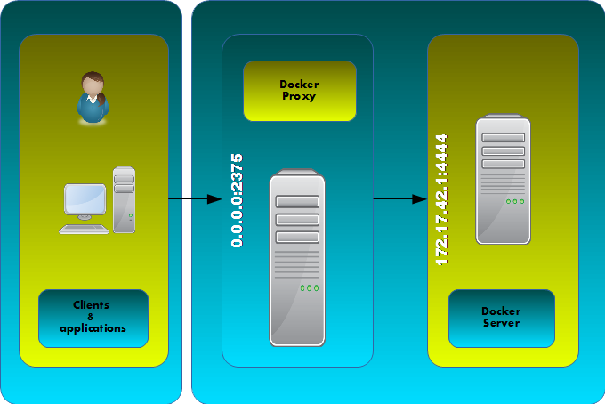

Nginx Proxy for Docker Rest API
===============================

**Https secure proxy and auth for [Docker](https://www.docker.com/) daemon (Rest API)**

Tested with [Docker](https://www.docker.com/) 1.3.1 on [Ubuntu](http://www.ubuntu.com/) 14.04

-   <http://srault95.github.io/docker-proxy-api>
-   <https://registry.hub.docker.com/u/srault95/docker-proxy-api/>

Features
--------

-   Basic auth http
-   Secure http by SSL certificate

Schema
------



Quick Start
-----------

-   Transparent installation. No port mapping
-   Replace DOCKER\_USER and DOCKER\_PASSWORD by your values

<!-- -->

    $ docker pull srault95/docker-proxy-api

    $ docker run --restart always -d --name docker-proxy -e DOCKER_USER=myuser -e DOCKER_PASSWORD=password srault95/docker-proxy-api

    $ DOCKER_PROXY=$(docker inspect -f '{{.NetworkSettings.IPAddress}}' docker-proxy)

    $ curl -k https://${DOCKER_PROXY}:2375/_ping

    $ curl -k -u myuser:password https://${DOCKER_PROXY}:2375/info

Pull image from registry
------------------------

    $ docker pull srault95/docker-proxy-api

Build
-----

Image from [Dockerfile](http://dockerfile.github.io/#/nginx)

    $ git clone https://github.com/srault95/docker-proxy-api.git

    $ cd docker-proxy-api

    $ docker build -t docker-proxy-api .

Configure docker daemon
-----------------------

    172.17.42.1 is default ip address for docker0 interface in ubuntu trusty

    $ vi /etc/default/docker

    DOCKER_OPTS="-H tcp://172.17.42.1:4444 -H unix:///var/run/docker.sock"

    $ service docker reload

Run for testing
---------------

``` {.sourceCode .bash}
$ docker run -it --rm -p 2375:2375 srault95/docker-proxy-api
```

Run for production
------------------

``` {.sourceCode .bash}
$ docker run -d --name docker-proxy -p 2375:2375 srault95/docker-proxy-api
```

Test Rest request with curl
---------------------------

Use curl -k or --insecure for curl with auto-certificate

    # without authentication (only for _ping)
    $ curl -k https://127.0.0.1:2375/_ping
    OK

    # with authentication
    $ curl -k -u docker:docker https://127.0.0.1:2375/info
    {"Containers":38,"Debug":0,"Driver":"aufs","DriverStatus":[["Root Dir","/home/docker/aufs"],["Dirs","893"]],"ExecutionDriver":"native-0.2","IPv4Forwarding":1,"Images":811,"IndexServerAddress":"https://index.docker.io/v1/","InitPath":"/usr/bin/docker","InitSha1":"","KernelVersion":"3.13.0-39-generic","MemoryLimit":1,"NEventsListener":0,"NFd":16,"NGoroutines":23,"OperatingSystem":"Ubuntu 14.04.1 LTS","SwapLimit":1}

No port mapping
---------------

    $ docker run -d --name docker-proxy srault95/docker-proxy-api

    $ DOCKER_PROXY=$(docker inspect -f '{{.NetworkSettings.IPAddress}}' docker-proxy)

    $ curl -k https://${DOCKER_PROXY}:2375/_ping
    OK

For remplace SSL certificate and password on start contenair
------------------------------------------------------------

    $ docker run -e FORCE_CONFIG=1 -d --name docker-proxy -p 2375:2375 srault95/docker-proxy-api

For change SSL parameters
-------------------------

    # Default values
    SSL_COMMON_NAME=localhost
    SSL_RSA_BIT=4096
    SSL_DAYS=365

    $ docker run -d --name docker-proxy -p 2375:2375 \
      -e FORCE_CONFIG=1 -e SSL_COMMON_NAME=my_common_name -e SSL_RSA_BIT=2048 -e SSL_DAYS=730 \
      srault95/docker-proxy-api

For change login/password
-------------------------

Password max length: 8 characters

    # Default values
    DOCKER_USER=docker
    DOCKER_PASSWORD=docker

    $ docker run -d --name docker-proxy -p 2375:2375 \
      -e FORCE_CONFIG=1 -e DOCKER_USER=user -e DOCKER_PASSWORD=password \
      srault95/docker-proxy-api

    $ curl -k -u user:password https://127.0.0.1:2375/info

For use external certificate
----------------------------

Warning: if you use "-e FORCE\_CONFIG=1" after creating your certificates, your files will be deleted

1.  Generate your certificate with openssl or import your existant certificat:

        $ mkdir nginx-certs
        $ openssl genrsa -out nginx-certs/server.key 1024
        $ openssl req -new -newkey rsa:4096 -days 365 -nodes -subj "/C=/ST=/L=/O=/CN=localhost" -keyout nginx-certs/server.key -out nginx-certs/server.csr
        $ openssl x509 -req -days 365 -in nginx-certs/server.csr -signkey nginx-certs/server.key -out nginx-certs/server.crt

2.  Use docker volume:

        $ docker run -d --name docker-proxy -p 2375:2375 \
          -v `pwd`/nginx-certs:/etc/nginx/certs \
          srault95/docker-proxy-api

For use external password file
------------------------------

1.  Create new password file:

        $ printf "user:$(openssl passwd -crypt 12345678)\n" > my_passwd_file

2.  Run contenair with volume option:

        $ docker run -e NO_GEN_PASSWORD=1 -d --name docker-proxy -p 2375:2375 \
          -v `pwd`/my_passwd_file:/etc/nginx/.passwd \
          srault95/docker-proxy-api

3.  Test:

        $ curl -k -u user:12345678 https://127.0.0.1:2375/info

Change ip:port address of your docker daemon
--------------------------------------------

-   Copy or edit docker-proxy.conf and change value:

        proxy_pass http://172.17.42.1:4444;

-   Use docker-proxy.conf in volume:

        $ docker run -d --name docker-proxy -p 2375:2375 \
          -v /docker-proxy.conf:/etc/nginx/docker-proxy.conf \
          srault95/docker-proxy-api

Access with python
------------------

-   <https://github.com/docker/docker-py>

<!-- -->

    $ virtualenv docker

    $ source docker/bin/activate

    $ pip install docker-py

    $ python
    >>> import docker
    >>> tls_config = docker.tls.TLSConfig(verify=False)
    >>> c = docker.Client(base_url='https://127.0.0.1:2375', tls=tls_config)
    >>> c.auth = ('docker', 'docker')
    >>> c.ping()

    For disable SSL warnings from urllib3

    >>> from requests.packages import urllib3
    >>> urllib3.disable_warnings()

Nginx Logs
----------

-   Nginx logs redirect to /dev/stdout and /dev/stderr for display in "docker logs CID"
-   Accès logs on host with json format

<!-- -->

    DOCKER_PROXY_ID=$(docker inspect -f '{{.Id}}' docker-proxy)

    cat /var/lib/docker/containers/${DOCKER_PROXY_ID}/${DOCKER_PROXY_ID}-json.log

    $ echo /var/lib/docker/containers/${DOCKER_PROXY_ID}/${DOCKER_PROXY_ID}-json.log
    /var/lib/docker/containers/ddda603702be34d99ab5b0a8bdea06bd821ebe4870ef50414063e4417901c532/ddda603702be34d99ab5b0a8bdea06bd821ebe4870ef50414063e4417901c532-json.log

    $ python
    >>> import json, pprint
    >>> values = open('/var/lib/docker/containers/ddda603702be34d99ab5b0a8bdea06bd821ebe4870ef50414063e4417901c532/ddda603702be34d99ab5b0a8bdea06bd821ebe4870ef50414063e4417901c532-json.log').readlines()

    >>> for value in values: pprint.pprint(json.loads(value))
    ...
    {u'log': u'SSL certificate generation...\n',
     u'stream': u'stdout',
     u'time': u'2014-12-12T09:56:12.912944973Z'}
    {u'log': u'Password generation...\n',
     u'stream': u'stdout',
     u'time': u'2014-12-12T09:56:13.796529889Z'}

    >>> for value in values: print json.loads(value)['time']
    ...
    2014-12-12T09:56:12.912944973Z
    2014-12-12T09:56:13.796529889Z

Todos / Ideas
-------------

-   Documentation en Français
-   Add schema
-   Publish to HUB registry
-   Drone test: [Drone](https://drone.io/)
-   Test with -api-enable-cors
-   Optimisations nginx
-   Configuration for ip address of docker in proxy\_pass
-   Add authentication method
-   optionnal ssl and password
-   Interest of links from this contenair:

        $ docker run -it --rm --link docker-proxy:proxy ubuntu env | grep PROXY_PORT    

        PROXY_PORT_2375_TCP=tcp://172.17.0.15:2375
        PROXY_PORT_2375_TCP_ADDR=172.17.0.15
        PROXY_PORT_2375_TCP_PORT=2375
        PROXY_PORT_2375_TCP_PROTO=tcp


